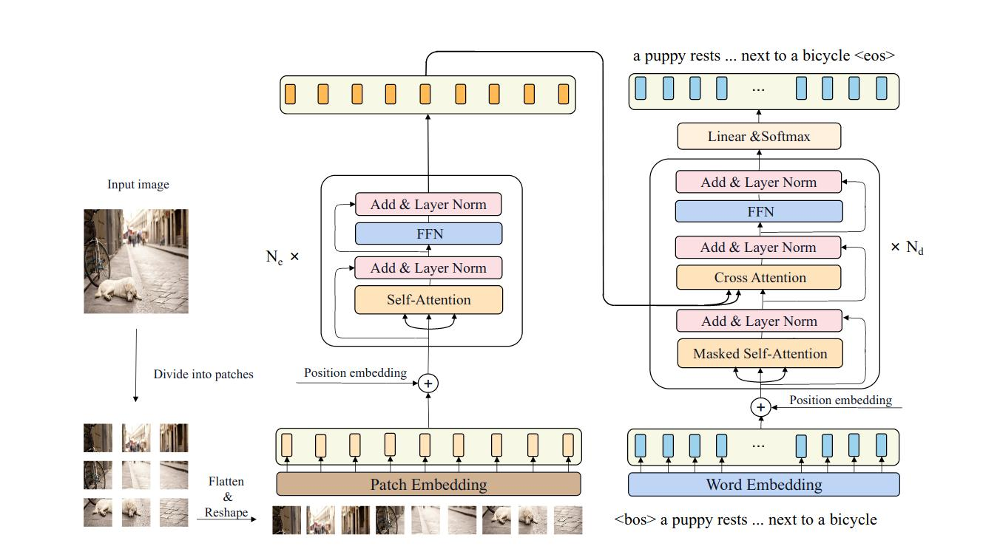
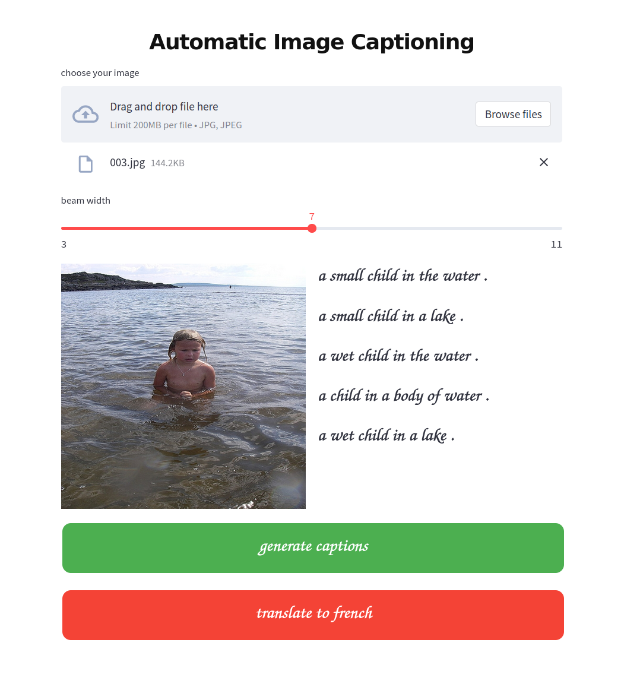
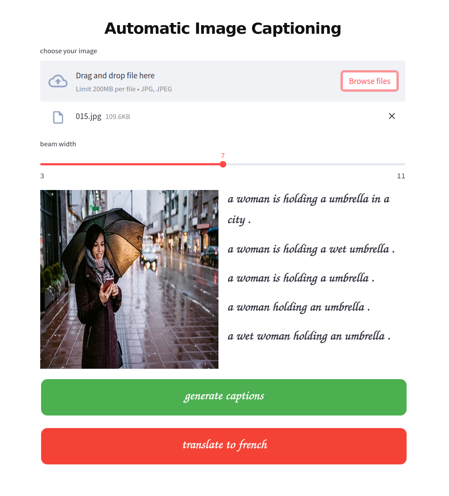
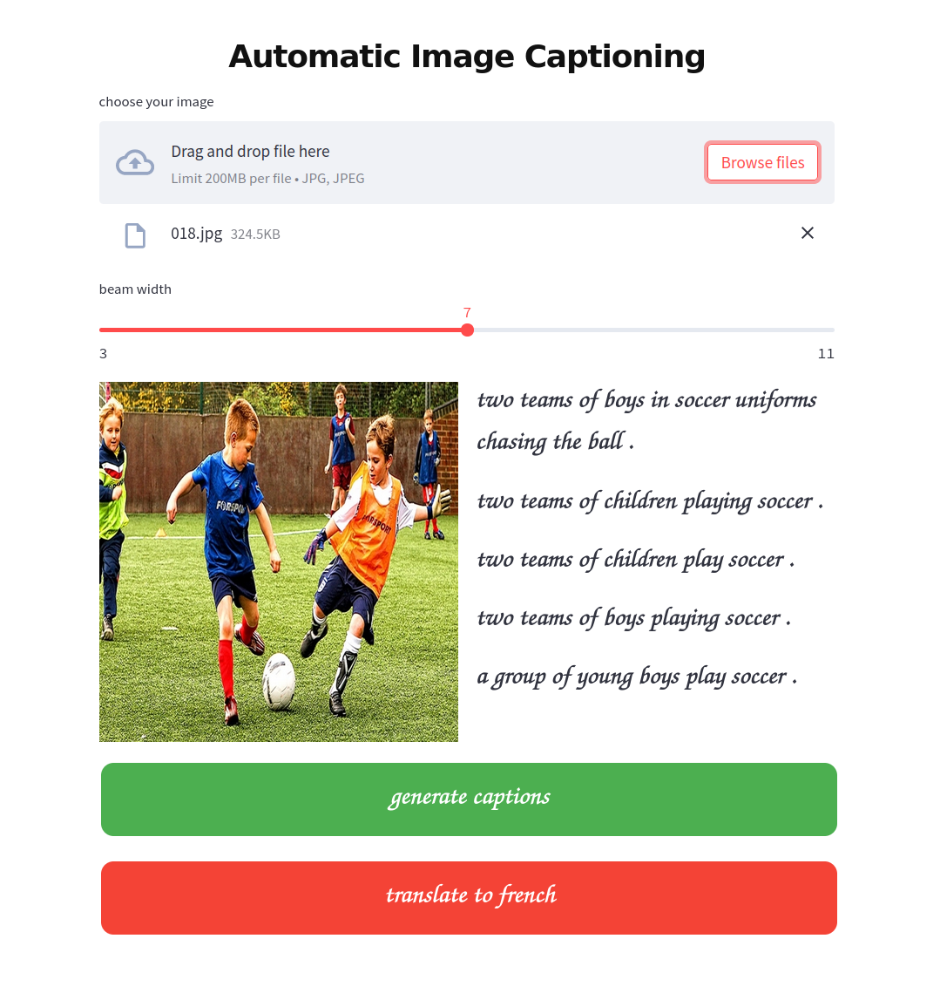
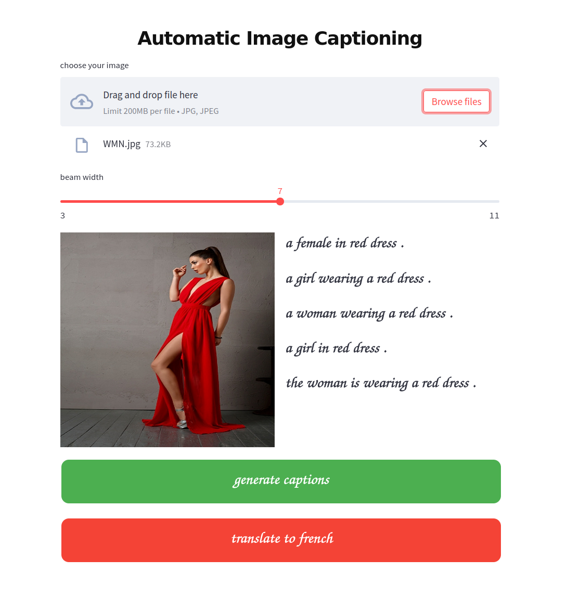
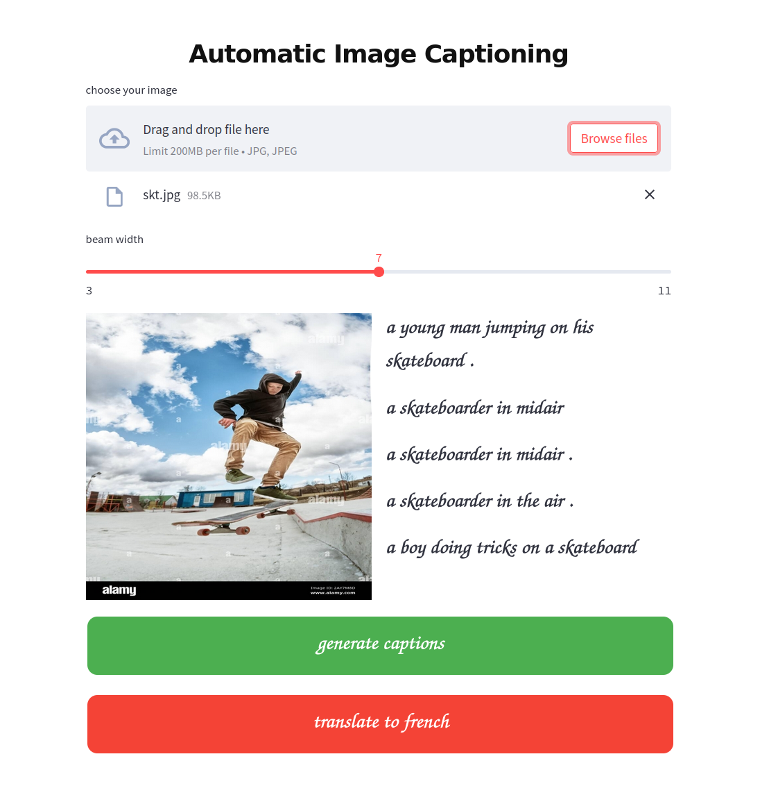
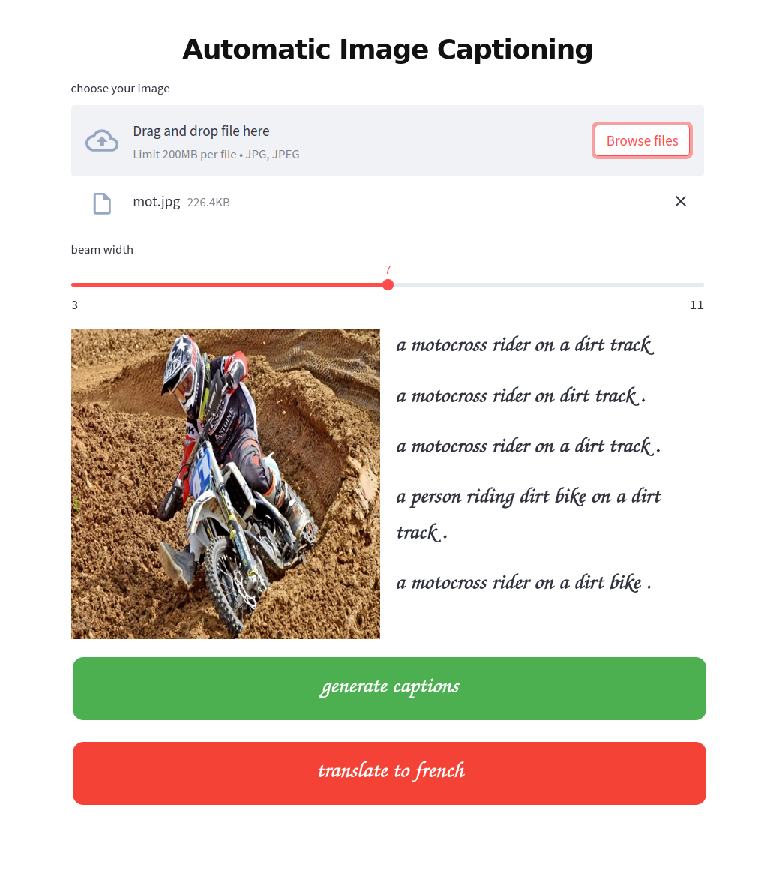

# transformer-image-captioning
Implementation of the paper CPTR : FULL TRANSFORMER NETWORK FOR IMAGE CAPTIONING

<p align="center"> 
  
  <h3 align="center">
    architecture of the CPTR model for image captioning 
  </h3>  
</p>

---
---

# predictions 

<p float="left">
  
  
</p>

<p float="left">
  
  
</p>

<p float="left">
   
  
</p>

# prerequisites
* git
* python3
* python3-venv
* docker  

# clone the repo and prepare data 
```bash
    # clone 
    git clone https://github.com/Milkymap/transformer-image-captioning
    cd transformer-image-captioning
    # prepare data 
    # models is the space where resnet152 and clip will be saved 
    # models also contains the checkpoints during training 
    # images contains a set of image files for inference time(see docker describe step)
    # source contains the data used for training 
        # the data is in the next format 
        # images directory : contains all images for training 
        # captions.json    : is a hashmap(image_file_id=>[text, text, text])
    # target contains extracted features such as vectors, tokenizer, vocabulary
    mkdir models images source target 
```

# docker build and run 
```bash
    docker build -t capformer:0.0 -f Dockerfile.gpu
```

# docker run processing step 
```bash
    docker run 
        --rm 
        --tty 
        --name capformer 
        --gpus all 
        -v $(pwd)/source:/home/solver/source 
        -v $(pwd)/models:/home/solver/models 
        -v $(pwd)/target:/home/solver/target
        -v $(pwd)/images:/home/solver/images  
        -e TERM=xterm-256color 
        capformer:0.0 processing 
            --path2images /home/solver/source/images 
            --path2captions /home/solver/source/captions.json 
            --path2vectorizer /home/solver/models/resnet152.th 
            --extension jpg 
            --path2features /home/solver/target/map_img2features.pkl 
            --path2tokenids /home/solver/target/zip_img2tokenids.pkl 
            --path2vocabulary /home/solver/target/vocabulary.pkl
```


# docker run learning step
```bash
    docker run 
        --rm 
        --tty 
        --name capformer 
        --gpus all 
        -v $(pwd)/source:/home/solver/source 
        -v $(pwd)/models:/home/solver/models 
        -v $(pwd)/target:/home/solver/target
        -v $(pwd)/images:/home/solver/images  
        -e TERM=xterm-256color 
        capformer:0.0
        learning 
            --path2features /home/solver/target/map_img2features.pkl 
            --path2tokenids /home/solver/target/zip_img2tokenids.pkl 
            --path2vocabulary /home/solver/target/vocabulary.pkl 
            --nb_epochs 92 
            --bt_size 128 
            --path2checkpoint /home/solver/models/checkpoint_128.th 
            --checkpoint 16 
            --start 0
``` 

# docker run describe step
```bash
    docker run 
        --rm 
        --tty 
        --name capformer 
        --gpus all 
        -v $(pwd)/source:/home/solver/source 
        -v $(pwd)/models:/home/solver/models 
        -v $(pwd)/target:/home/solver/target 
        -v $(pwd)/images:/home/solver/images 
        -e TERM=xterm-256color 
        capformer:0.0 
        describe 
            --path2vectorizer /home/solver/models/resnet152.th 
            --path2ranker /home/solver/models/ranker.pkl 
            --path2vocabulary /home/solver/target/vocabulary.pkl 
            --path2checkpoint /home/solver/models/checkpoint_128.th 
            --beam_width 17 
            --path2image /home/solver/images/bob.jpg
```

# structure of the project

this project is based on opensource libraries such as **[pytorch, clip(openai), opencv, PIL]** 
It contains :
* **core.py**
    * this is the main file of the project
    * it contains the definition of the transformer
    * it is based on the paper Attention Is All You Need 
    * i added some modifications for handling multiple output of the decoder
* **dataset.py**
    * this file contains two classes :
    * DatasetForFeaturesExtraction 
    * DatasetForTraining 
* **model.py**
    * this file contains the definition of the CPTR model 
    * it uses the transformer defined on the core module 
    * it has some additional moduless like : token_embedding, prediction_head       
* **libraries**
    * contains usefull functions such as : 
    * log handler 
    * tokenization 
    * features extraction 
    * model loading
    * **beam and greedy search** for caption generation   
* **static**
    * contains images and fonts for the readme
* **main.py**
    * this is the entrypoint of the program
    * it defines three subcommands 
    * processing : for features extraction and tokenization 
    * learning   : training loop of the CPTR 
    * describe   : generate caption by taking an image path 
* **.gitignore**
* **.dockerignore**
* **Dockerfile.gpu**
* **LICENCE**
* **README.md** 

# Citations

```bibtex
@misc{Liu2021cptr,
    title   = {CPTR: FULL TRANSFORMER NETWORK FOR IMAGE CAPTIONING}, 
    author  = {Wei Liu, Sihan Chen, Longteng Guo, Xinxin Zhu1, Jing Liu1},
    year    = {2021},
    eprint  = {2101.10804},
    archivePrefix = {arXiv},
    primaryClass = {cs.CV}
}
```
